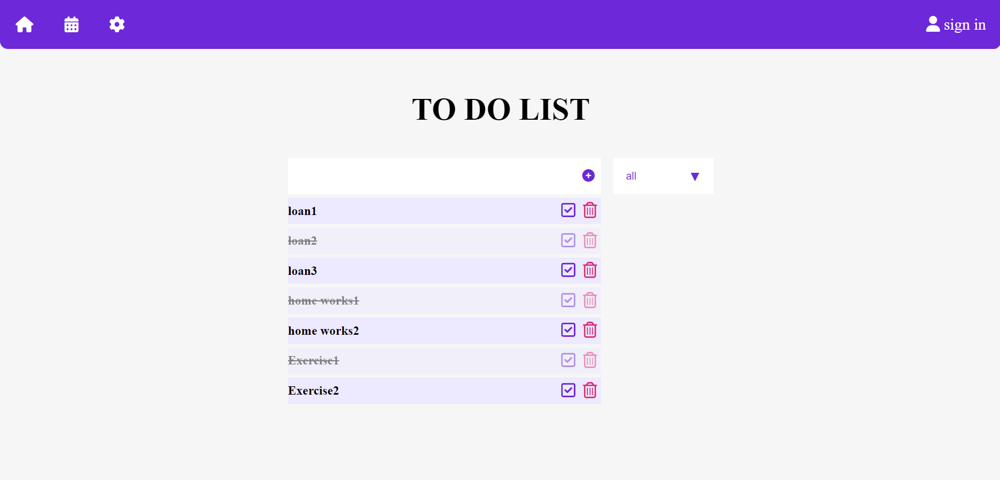

# TodoList-Project
in this project, Practice JS and Local Storage

 

 
## About The Project
 - Store a data in Local storage
 - and remove and add bay js to domin
 
  
 ## Built with

- Semantic HTML5 markup
- CSS custom properties
- Flexbox
- CSS Grid
- Java Script

 
## Links
 - Live site URL : ......
